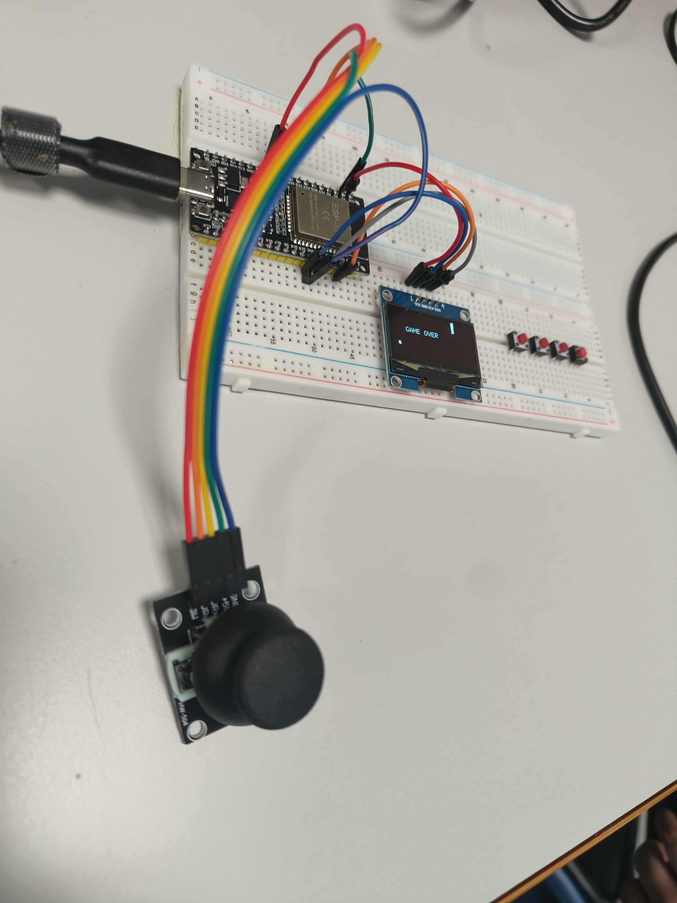
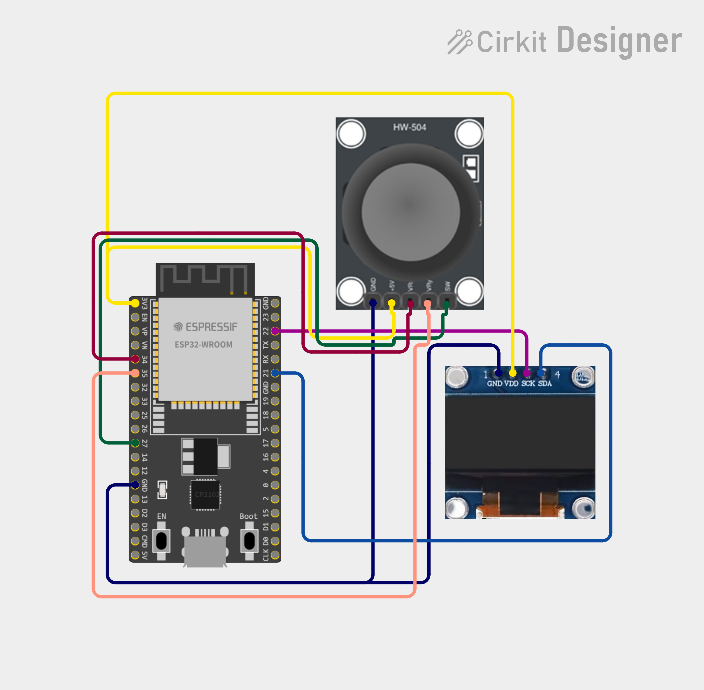

## 🕹️ ESP32 Handheld Console

## Breadboard prototype

This project is developed as part of the **Electronic Product Development** (*Elektronisk Produktudvikling*) course at **UCL University College (Seebladsgade, Odense)** by an IT Technology student.

The goal of this project is to prototype and develop a compact, ESP32-based handheld gaming console. The system currently runs a fully functional version of the classic game **Snake**. The project is in the breadboard prototyping phase, with the ultimate objective of engineering and routing a custom **Printed Circuit Board (PCB)**.

## 🚀 Project Overview
The console utilizes an ESP32 microcontroller to execute the Snake game logic, process control inputs, and update the game graphics on a **1.3" OLED display** using the I2C communication protocol.

### 🛠️ Hardware Components
*   **Microcontroller:** ESP32 Development Board (esp32dev)
*   **Display:** 1.3" OLED Display (SH1106 / SSD1306 driver, I2C interface)
*   **Input:** HW-504 Joystick Module (Configured for analog direction control)

---

## 🔌 Hardware Wiring Diagram (Pin Mapping)

Based on the current firmware configuration, the components are interfaced with the ESP32 using the following pin mapping:

### 1. I2C OLED Display

| OLED Pin | ESP32 GPIO | Description |
| :--- | :--- | :--- |
| **GND** | GND | Ground |
| **VCC** | 3V3 / 5V | Power Supply |
| **SCL** | GPIO 22 | I2C Hardware Clock [1] |
| **SDA** | GPIO 21 | I2C Hardware Data [1] |

### 2. HW-504 Joystick / Control Buttons
*Note: Pins are defined digitally in the firmware for directional control.*

| Function / Direction | ESP32 GPIO | Description |
| :--- | :--- | :--- |
| **UP** | GPIO 25 | Input for upward movement [1] |
| **DOWN** | GPIO 26 | Input for downward movement [1] |
| **LEFT** | GPIO 27 | Input for leftward movement [1] |
| **RIGHT** | GPIO 32 | Input for rightward movement [1] |

---
