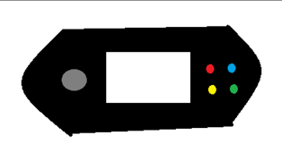

# 🕹️ ESP32 Handheld Console

## Breadboard prototype

This project is developed as a **group project** by IT Technology students as part of the **Electronic Product Development** (*Elektronisk Produktudvikling*) course at **UCL University College (Seebladsgade, Odense)**.

The goal of this project is to prototype and develop a compact, ESP32-based handheld gaming console. The system currently runs a fully functional version of the classic game **Snake**. The project is in the breadboard prototyping phase, with the ultimate objective of engineering and routing a custom **Printed Circuit Board (PCB)** and housing.

## 🚀 Project Overview
The console utilizes an ESP32 microcontroller to execute the Snake game logic, process control inputs, and update the game graphics on a **1.3" OLED display** using the I2C communication protocol.

### 🛠️ Hardware Components
*   **Microcontroller:** ESP32 Development Board (esp32dev)
*   **Display:** 1.3" OLED Display (SH1106 / SSD1306 driver, I2C interface)
*   **Input:** HW-504 Joystick Module (Configured for analog direction control)

---

## 🎨 Concept Design & Ideation

Based on initial ideation and brainstorm sessions, the project aims to develop a robust, ergonomic handheld gaming unit with integrated tactile controls.

### Form Factor & Industrial Design

*   **Ergonomics:** Designed for maximum grip comfort to mitigate wrist fatigue during long play sessions.
*   **Enclosure:** Fully custom, compact 3D-printed layout optimized for component clearance.
*   **Robustness:** High structural rigidity ensuring a shock-proof joystick and button assembly.

### Technical Concept & Features
*   **Game Ecosystem:** Launched with *Snake*, with architecture prepared for *Space Invaders*, *Pac-Man*, *Tamagotchi*, and *Tetris*.
*   **Control Hardware:** Initial dual-axis analog joystick tracking. Future additions include multi-colored input buttons, gyroscope/motion sensors, and haptic rumble capabilities.
*   **Audio Feedback:** Planned expansion utilizing an integrated hardware speaker or magnetic buzzer for retro tone generation.
*   **Thermal Management:** PCB routing prioritized for optimal heat dissipation to avoid any overheating issues.

---

## 👥 Target Audience & Personas

To guide the product development process, two core user personas were established to evaluate usability and feature sets:

### Persona 1: The Young Gamer
*   **Demographic:** 10-year-old boy.
*   **Language Support:** Bilingual (Danish and English).
*   **Aesthetic Preference:** Green or blue product accents.
*   **Goal:** Instant, intuitive gameplay loop requiring simple, indestructible controls.

### Persona 2: The Enthusiast Gamer
*   **Demographic:** 18-year-old young man.
*   **Language Support:** Bilingual (Danish and English).
*   **Aesthetic Preference:** Stealth-black matte enclosure.
*   **Social/Tech Hubs:** Active on Discord, YouTube, Reddit, and TikTok.
*   **Goal:** A high-refresh-rate retro gaming experience with precise analog threshold response.

---

## 🔌 Hardware Wiring Diagram (Pin Mapping)

Based on the current firmware configuration, the components are interfaced with the ESP32 using the following pin mapping:

### 1. I2C OLED Display

| OLED Pin | ESP32 GPIO | Description |
| :--- | :--- | :--- |
| **GND** | GND | System Ground |
| **VCC** | 3V3 / 5V | Power Supply |
| **SCK** | GPIO 22 | I2C Hardware Clock |
| **SDA** | GPIO 21 | I2C Hardware Data |

### 2. HW-504 Analog Joystick
*Note: The joystick pins are connected to the ESP32's ADC channels to sample analog voltage levels.*

| Joystick Pin | ESP32 GPIO | Direction / Function | Description |
| :--- | :--- | :--- | :--- |
| **GND** | GND | - | Common Ground |
| **+5V** | 5V / 3V3 | - | Power Supply for the joystick potentiometers |
| **VRx** | GPIO 25 | X-Axis | Analog input (Horizontal movement) |
| **VRy** | GPIO 26 | Y-Axis | Analog input (Vertical movement) |
| **SW** | GPIO 27 | Push Button | Digital input (Configured with `INPUT_PULLUP` in code) |

---

## 📊 Bill of Materials (BOM)

The table below outlines the components utilized for the initial hardware prototype:

| Component | Model / Specification | Function in Project | Quantity |
| :--- | :--- | :--- | :--- |
| **Microcontroller** | ESP32 DevKit (38-pin NodeMCU) | Main processor, game logic, and I/O control | 1 |
| **OLED Display** | 1.3" I2C Screen (SH1106 driver) | Renders game graphics and UI elements | 1 |
| **Joystick** | HW-504 Dual-Axis Module | Controls snake direction via analog readings | 1 |
| **Breadboard** | Standard Solderless Breadboard | Temporary mounting and testing of the circuit | 1 |
| **Jumper Wires** | Dupont Cables (Male-Male / Male-Female) | Interconnections between the ESP32 and modules | 14 |

---

## 📄 License
This project is open-source and available under the [MIT License](LICENSE).
